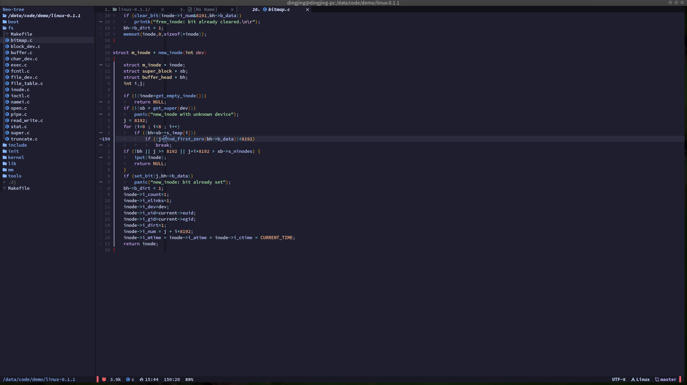

# neovim 配置



## neovim 安装

archlinux
```
pacman -S neovim
```

ubuntu
```
apt install neovim
```

centos
```
yum install neovim
```
## 配置 neovim 

在源码目录执行:
```shell
./install.sh
```

下次执行 nvim 就会自动下载配置好的插件


## 常用功能

### ctags

使用 ctags 一定要直接在项目根目录打开，具体操作：
1. 进入项目根目录，执行
```shell
vim .
```
2. 在 nvim 命令行模式下创建索引
```shell
:GenerateTags
```

在函数处使用 `ctrl + ]` 跳转到函数定义的位置，使用 `ctrl + o` 返回调用处

> 其它后续补充

